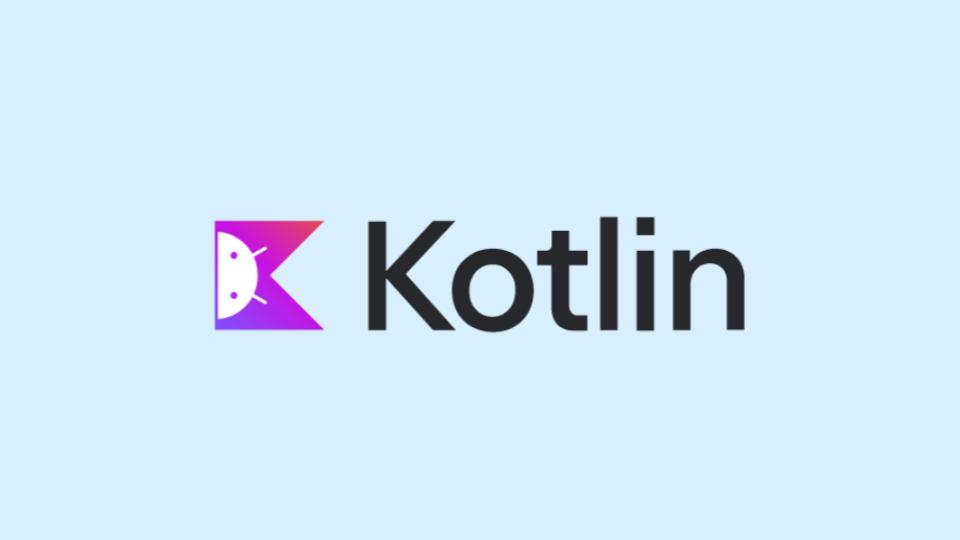
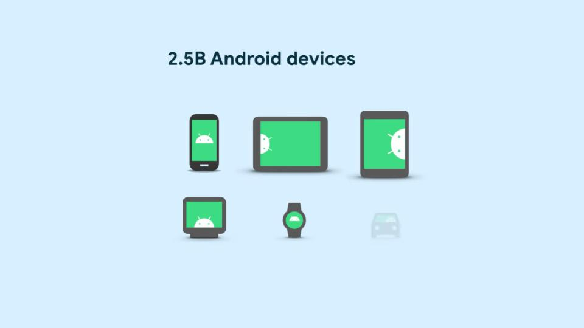
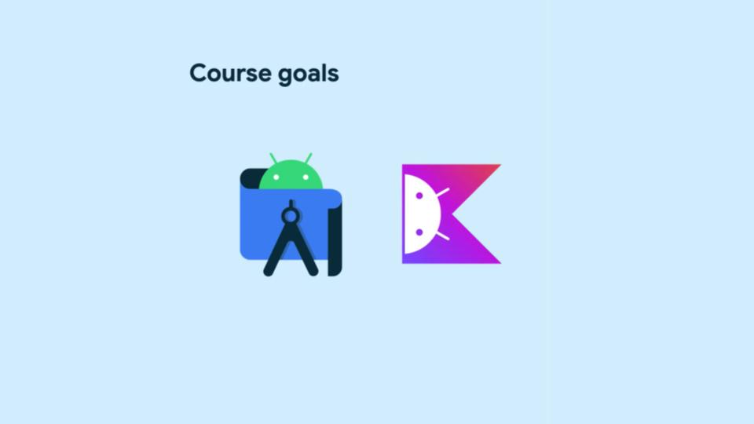
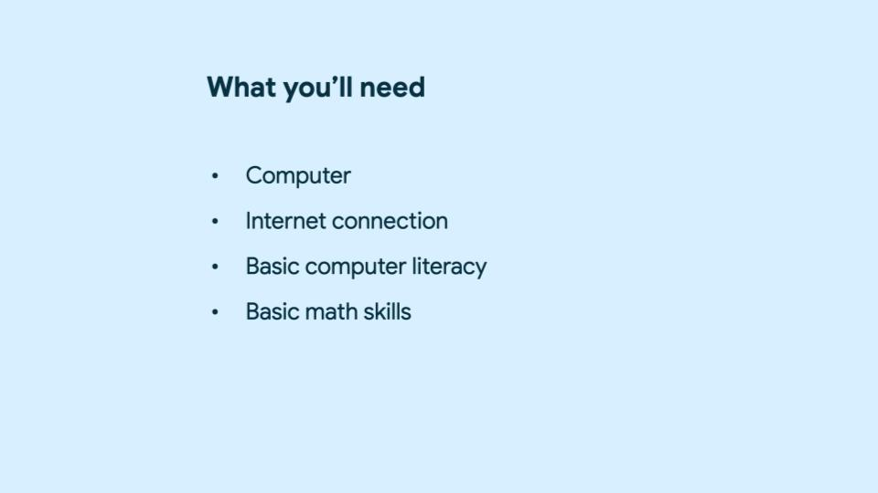

<!-- new slide -->

# Présentation de la programmation en Kotlin

## Introduction


Kotlin est un langage de programmation moderne qui aide les développeurs à être plus productifs. vous pouvez créer de meilleures applications Android en utilisant Kotlin.



Il existe 2,5 milliards d’appareils Android dans le monde.



Ainsi, à travers ce cours, nous apprendrons ce qu'est Android Studio et Kotlin.


Ce dont nous aurons besoin pour commencer ce cours est le suivant:
- Ordinateur
- Connexion Internet
- Connaissances informatiques de base
- Compétences mathématiques de base

## Votre premier programme à Kotlin

Ce code Kotlin d'une fonction affichera un message "Hello, world!"

````kotlin
    fun main() {
        println("Hello, world!")
    }
````
Ce code Kotlin contient une erreur qui devrait être corrigée.

````kotlin
    fun main(){
        var nom = "Reda"
        var bonjour_nom = Bonjour(nom)
        println(bonjour_nom)
        println(nom)
    }
    
    fun Bonjour(nom:String):String{
        nom = "Bonjour" + nom
        return nom
    }
````
Afin d'écrire des variables dans une chaîne:

````kotlin
    fun main() {
        val count: Int = 10
        println("You have $count unread messages.")
    }

    fun main() {
        val unreadCount = 5
        val readCount = 100
        println("You have ${unreadCount + readCount} total messages in your inbox.")
    }
````